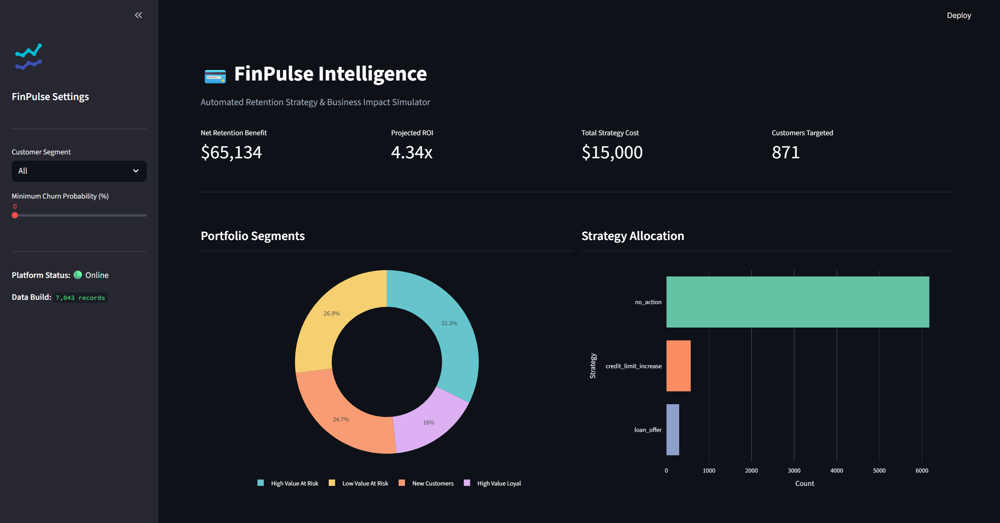
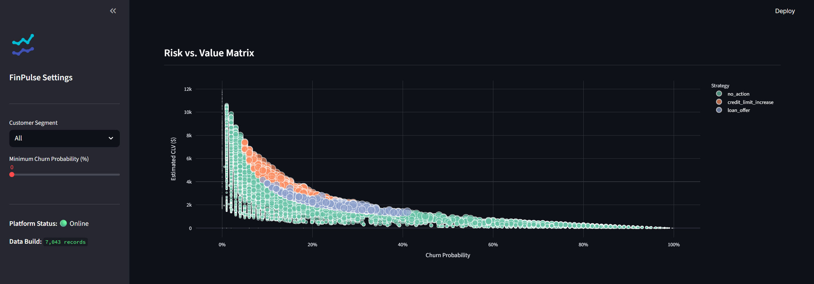

# 💳 FinPulse — Customer Decision Intelligence Platform

End-to-end analytics system that transforms customer data into retention strategies with quantified financial impact for fintech and banking organizations.

---

## 🎯 Executive Summary

Financial institutions struggle to allocate retention budgets efficiently, often applying blanket strategies that waste resources or fail to target high-value clients at critical risk. 

**FinPulse** provides data-driven decision support to solve this optimization problem. It is designed for analytics product teams, customer success leaders, and financial executives. By bridging the gap between predictive modeling and business logic, FinPulse identifies high-value customers at risk and automatically recommends optimal, ROI-positive retention actions.

---

## 💡 Key Capabilities

### 🔍 Customer Intelligence
* **Behavioral Segmentation**: Unsupervised clustering (K-Means with automated K-selection via silhouette score) on median-imputed, scaled value/engagement features. Business labels apply when k==4, generic `Segment_{i}` names otherwise. Scaler + model persist atomically with a `metadata.json` sidecar (k, silhouette, sklearn version); `use_stored=True` reuses persisted models via transform/predict instead of refitting.
* **Churn Prediction**: RandomForest (`class_weight="balanced_subsample"`, `max_depth=12`, stratified split) with precision/recall/F1/ROC-AUC + confusion-matrix sidecar. A single shared `FEATURE_COLS` constant guarantees train/serve parity (persisted to `churn_feature_columns.json`; inference reindexes unseen categories to 0). Feedback columns (`churn_probability`, `estimated_clv`, `priority_score`, …) are excluded to break feedback loops.
* **Financial CLV Estimation**: Retention-based Customer Lifetime Value (`CLV = (ARPU * Retention) / (1 + Discount - Retention)`), fail-closed — missing churn probability implies retention 0; denominator floored at `CLV_MIN_DENOM`; non-finite results quarantined to 0 with an `is_clv_quarantined` flag.

### 🎯 Decision Optimization (V2 Enterprise Engine)
* **4-Layer Decision Framework**: Sequential processing across Base Valuation, Risk Adjustment, Eligibility Rules, and Portfolio Allocation.
* **Risk-Adjusted ROI**: Strategies are penalized based on the baseline churn risk of the customer, ensuring conservative allocation for high-risk targets. Slopes live in `configs/settings.py` (`RISK_SLOPES`); NaN churn draws the maximum penalty. An optional CLV-scaled mode exists behind a flag (default flat).
* **Fail-Closed Eligibility**: Missing/NaN gating values imply *ineligible* (`-inf`), never eligible. A missing `tenure_segment_new` column disqualifies cashback for all rows with a quarantine warning; `fee_waiver` is always eligible by design.
* **Portfolio Allocation**: Greedy ROI-density allocation subject to a monthly budget and per-strategy caps (`max(1, ceil(N*cap))`, ties broken on net value). Returns `(df, allocation_summary)` with a budget-overspend assert. A zero/non-positive budget blocks even zero-cost strategies (all `no_action`).

### 📈 Business Impact
* **Revenue Impact Simulation**: Reports gross retention gain *and* risk-adjusted net (`gross − cost − risk`, matching optimizer economics). Unknown strategies and NaN churn/CLV rows are quarantined with a warning and excluded from totals (`n_quarantined`); the input frame is never mutated.
* **ROI Semantics**: Zero cost + positive gain → `inf`; zero cost + zero gain → `0.0`; NaN/negative inputs are guarded to `0.0`.
* **Strategy Breakdown**: Per-strategy counts, percents, and unit costs as a DataFrame.
* **Interactive Dashboard**: Cached (`ttl=3600`), schema-guarded executive dashboard with WebGL risk matrix (downsampled past 5k rows), ref-ID error handling, and no remote assets.

---

## 🏗️ Architecture Overview

```text
[Raw Data] --> (Ingestion & Validation + quarantine)
                        ↓
[Feature Engineering] --> (Domain Transformation, Categorical Encoding)
                        ↓
[Customer Intelligence Layer]
  ├── Segmentation Engine (Clustering + metadata)
  ├── Predictive Engine (Churn Model + feature parity)
  └── Valuation Engine (CLV Calculation, fail-closed)
                        ↓
[Decision Engine]
  ├── Risk Adjustment (Probability-scaled Penalties)
  ├── Eligibility Masking (Fail-closed Tenure & Risk Rules)
  └── Portfolio Allocator (ROI Density vs. Global Budget + summary)
                        ↓
[Impact Simulation] --> (Gross + Risk-Adjusted Net, ROI & Breakdown)
                        ↓
[Executive Dashboard] --> (Interactive UI & Reporting)
```

---

## 🔄 End-to-End Workflow

The FinPulse system operates on a streamlined, modular pipeline:

1. **Data Ingestion**: Loads raw data via a single canonical path (`configs/settings.py: RAW_DATA_PATH`, overridable with `FINPULSE_RAW_PATH`). Structural bad rows are quarantined to `data/processed/quarantine_*.csv` with a validation report — the pipeline continues on clean rows and aborts only if nothing remains.
2. **Domain Transformation**: Maps base features to financial domain concepts (e.g., Monthly Spend, Account Tenure). Idempotent 10x scaling, `tenure==0 → NaN + is_zero_tenure` flag, min-max normalized engagement score, tenure bands (`new/early/mid/loyal/veteran`, `>72` never NaN). `tenure_segment` keeps all one-hot levels so the `tenure_segment_new` eligibility gate always exists; encoder columns persist for inference alignment.
3. **Segmentation**: Dynamically scales features and clusters the portfolio into actionable segments.
4. **Prediction**: Trains and scores the portfolio using a RandomForest classifier to establish baseline risk.
5. **Decision Optimization**: Multi-layer engine evaluates strategies against risk/value profiles, masks ineligible targets, and allocates assignments based on ROI density and global budget constraints.
6. **Impact Simulation**: Calculates gross gain, strategy cost, risk-penalty total, and risk-adjusted net, plus projected ROI of the recommended actions.
7. **Reporting**: Serves the insights via a high-performance Streamlit/Plotly web framework. `run_full_pipeline(checkpoint_dir=...)` optionally writes `processed.parquet` for lineage.

---

## 📊 Dataset & Domain Adaptation

FinPulse demonstrates the ability to adapt raw data sets to specific industry domains.

* **Dataset Source**: Initially built utilizing a standard Telco Customer Dataset (serving as a proxy for subscription-based service data).
* **Fintech Mapping**: The pipeline programmatically translates telco-specific fields into universal financial metrics (e.g., `MonthlyCharges` -> `monthly_spend`, `tenure` -> `account_tenure_months`).
* **Economic Scaling (10x Multiplier)**: Because Telco ARPU (~$70) does not match high-value Fintech economics, a **10x multiplier** (`FINTECH_SCALE` in `configs/settings.py`) is applied to `monthly_spend` and `lifetime_value` during Feature Engineering. This scales Customer Lifetime Values (CLV) to the $2,000–$4,000 range, enabling the Decision Engine to realistically evaluate strictly positive ROI for $100–$200 premium retention strategies. The transform is idempotent (re-runs skip re-scaling).
* **Assumptions**: The system assumes contractual or semi-contractual customer relationships where "churn" is a discrete event, mimicking SaaS, banking, or insurance models.

---

## 🛠️ Technology Stack

### 🧠 Analytics & Modeling
* **Pandas & NumPy**: High-performance vectorized data manipulation.
* **Scikit-Learn**: Machine learning (RandomForest, KMeans, StandardScaler) and validation metrics (Silhouette Score).
* **Joblib**: Model persistence and artifact registry.

### 📊 Visualization & UI
* **Streamlit**: Rapid web application framework for the executive interface.
* **Plotly Express**: Interactive, publication-quality data visualizations.

### ⚙️ Infrastructure
* **Python 3.9+**: Core execution environment.
* **Pytest**: Unit testing framework for ensuring logic stability (`tests/` covers ingestion quarantine, CLV edges, fail-closed eligibility, allocator constraints, simulator parity, and train/serve feature parity; CI runs `pytest` + `pip-audit`).
* **PyArrow**: Parquet checkpoints for pipeline lineage.

---

## 🚀 How to Run the Project

### 1. Installation
Clone the repository and install the required dependencies:
```bash
git clone https://github.com/Prachet0806/FinPulse.git
cd FinPulse
pip install -r requirements.txt
```

### 2. Pipeline Execution
Run the end-to-end analytical pipeline to generate models and output metrics. *Ensure your `PYTHONPATH` is set to the project root.* All `scripts/` entrypoints accept `--data-path` (defaults to the canonical `RAW_DATA_PATH`) and `--log-level`, and exit non-zero on fatal errors.
```bash
# On Windows (PowerShell)
$env:PYTHONPATH="."
python scripts/run_pipeline.py
python scripts/run_pipeline.py --data-path "data/raw/Telco-Customer-Churn.csv" --log-level INFO

# On Unix/macOS
export PYTHONPATH="."
python scripts/run_pipeline.py
```

### 3. Dashboard Launch
Start the interactive executive dashboard:
```bash
streamlit run dashboard/app.py
```

---

## 📸 Sample Outputs / Screenshots

*(Include screenshots of your dashboard here by adding images to a `docs/images/` directory)*

### 📊 Executive Dashboard

*A comprehensive view of portfolio ROI and retention impact.*

### 📈 Risk vs. Value Matrix

*Plotly-powered scatter matrix identifying high-value customers at immediate risk.*


---

## 🏢 Business Use Cases

While FinPulse is configured for Fintech, the underlying architecture is highly extensible to other domains:

* **Banking & Credit Cards**: Optimizing credit limit increases vs. fee waivers to prevent account closures.
* **Insurance**: Identifying policyholders at risk of non-renewal and calculating the cost-benefit of premium discounts.
* **B2B SaaS / Subscription Businesses**: Allocating Customer Success Manager (CSM) outreach bandwidth to clients with the highest potential systemic impact.

---

## 🧭 Design Principles

* **ROI-Driven Optimization**: We don't just predict churn; we optimize the *preventative response* based strictly on financial utility.
* **Permissive Pipeline, Fail-Closed Decisions**: The pipeline never aborts on bad rows — they are logged, quarantined to CSV, and skipped. But decisions fail closed: NaN/missing inputs imply ineligible/`no_action`, zero budget blocks even zero-cost actions, and unknown strategies raise quarantine warnings.
* **Explainability**: Complex models are mapped back to business-friendly segment labels and clear strategic recommendations.
* **Scalability**: The processing and decision layers are fully vectorized, allowing for rapid execution across millions of rows without distributed computing overhead.

---

## ⚠️ Limitations & Assumptions

* **Static Effectiveness Rates**: Currently, the strategy `effectiveness` and `cost` metrics in the `strategy_library` are static estimates. In reality, these would require empirical backing via historical A/B testing.
* **First-Order Impact Only**: The simulation assumes mutually independent churn events and does not account for secondary network effects or broader macroeconomic shifts.
* **Cost of Capital**: The CLV calculation utilizes a simplified universal discount rate.
* **One-Hot-Before-Split**: Categorical encoding currently happens before any train/test split; full fit-on-train/apply-to-test encoding is a tracked follow-up (inference already reindexes to persisted training columns).

---

## 🛤️ Future Enhancements (V2 Roadmap)

* **Next-Best-Offer Engine**: Context-aware recommendations utilizing collaborative filtering alongside the expected-value engine.
* **Linear Programming Solver**: Migrating from the current greedy ROI-density allocator to a formal LP solver (e.g., PuLP/SciPy) for exact mathematical optimization under competing constraints.
* **MLOps Integration**: Migration from local `joblib` persistence to a centralized `MLflow` tracking server for comprehensive model registry and versioning.
